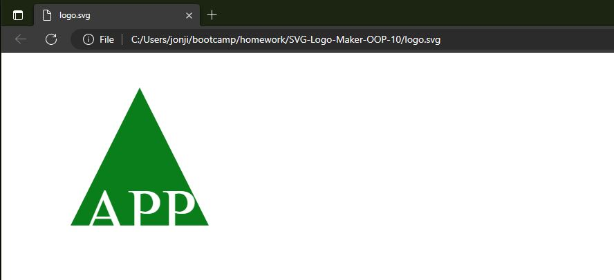

# SVG-Logo-Maker-OOP-10
[](https://opensource.org/licenses/MIT)

## MY Task

My task was to build a simple app that would take user input via questions and then creates a logo from their answers  [SVG file](https://en.wikipedia.org/wiki/Scalable_Vector_Graphics). The application prompts the user to select a color and shape, provide text for the logo, and save the generated SVG to a `.svg` file.

There is not a deployed site on GitHub Pages so below you will find a link to the repo on Github and also a link where you will be able to watch the SVG Logo Maker being used in real time. 

 [Video Submission](https://www.loom.com/share/b1a5ab985f014e538eb9d1b87546cc52) 
 [GitHub Repo Link](https://github.com/jonjigoncalves/SVG-Logo-Maker-OOP-10) 

> **Note**: The video was created with the Loom extenstion on Chrome.

### User Story

```md
AS a freelance web developer
I WANT to generate a simple logo for my projects
SO THAT I don't have to pay a graphic designer
```

## Acceptance Criteria

```md
GIVEN a command-line application that accepts user input
WHEN I am prompted for text
THEN I can enter up to three characters
WHEN I am prompted for the text color
THEN I can enter a color keyword (OR a hexadecimal number)
WHEN I am prompted for a shape
THEN I am presented with a list of shapes to choose from: circle, triangle, and square
WHEN I am prompted for the shape's color
THEN I can enter a color keyword (OR a hexadecimal number)
WHEN I have entered input for all the prompts
THEN an SVG file is created named `logo.svg`
AND the output text "Generated logo.svg" is printed in the command line
WHEN I open the `logo.svg` file in a browser
THEN I am shown a 300x200 pixel image that matches the criteria I entered
```

## Screenshot of the Logo Generated

The following image shows a mock-up of the generated SVG given the following input entered by the user: `SVG` for the text, `white` for the text color, `circle` from the list of shapes, and `green` for the shape color. Note that this is just an image of the output SVG and not the SVG file itself:



## Additional Requirements

 The application will be invoked by using the following command:

```bash
node index.js
```


```md
.  
├── examples/           // Example svg file(s) created with the app
├── lib/                // Folder for classes or functions
    ├── shapes.js       // Exports `Triangle`, `Circle`, and `Square` classes
    ├── shapes.test.js  // Jest tests for shapes
    └── more...         // Additional files and tests
├── .gitignore          // Indicates which folders and files Git should ignore
├── index.js            // Runs the application using imports from lib/
├── package.json
└── README.md           // App description, link to video, setup and usage instructions           
```


## Helpful Resources

* [Example SVG](https://static.fullstack-bootcamp.com/fullstack-ground/module-10/circle.svg)

* [Inquirer.js](https://www.npmjs.com/package/inquirer)

* [SVG tutorial](https://developer.mozilla.org/en-US/docs/Web/SVG/Tutorial)

* [Basic SVG shapes](https://developer.mozilla.org/en-US/docs/Web/SVG/Tutorial/Basic_Shapes)

* [Text in SVG](https://developer.mozilla.org/en-US/docs/Web/SVG/Tutorial/Texts)

* [Jest](https://www.npmjs.com/package/jest)


---
© 2023 edX Boot Camps LLC. Confidential and Proprietary. All Rights Reserved.